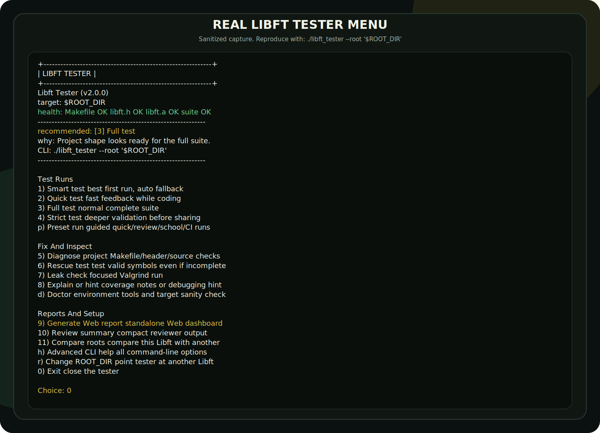
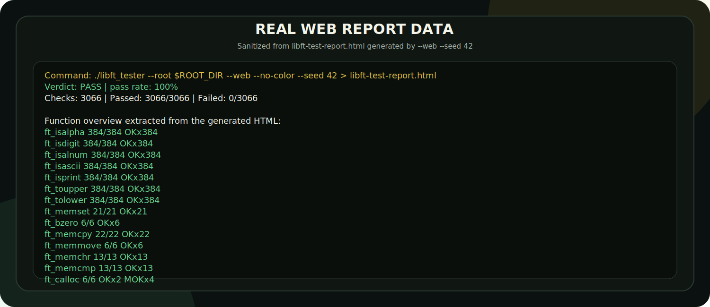

# Libft Tester


Libft Tester is a Web-first, terminal-friendly tester for `libft` projects.

It is useful for students, reviewers, maintainers, and anyone working on a
small C standard-library-style project that exposes the usual `ft_*` functions.
It was built with the 42 `libft` subject in mind, but the workflow is meant to
be understandable even if you are not from 42.

The main command is intentionally simple:

```sh
./libft_tester --root ../libft
```

That opens an interactive menu when your terminal supports input. If the driver
is not built yet, run `make build` once first. The `make` command still exists as
a convenience shortcut, but the day-to-day interface is the standalone
`./libft_tester` binary.

## What's New

- Web-first dashboard reports with `--web`, while `--html` remains as a compatibility alias.
- Named presets with `--preset quick`, `--preset review`, `--preset school`,
  `--preset ci`, `--preset web`, `--preset html`, and `--preset brutal`.
- Guided preset selection in the interactive menu, so new users do not need to
  memorize long commands.
- Optional `.libft-tester.json` config can now define a default `preset`.
- `--presets` lists every preset and the exact arguments it expands to.
- `--compare PATH` compares two Libft roots with the same test options.
- Stronger self-tests protect preset expansion, config presets, compare output,
  review output, Web reports, and fallback behavior.

## Real Captures

The README does not use mock screenshots. The images below are generated from
real tester commands against a real Libft target. They are documentation
artifacts, not hand-drawn previews.

Real interactive menu capture:



Real Web report data captured from generated HTML:



Reproduce the menu locally:

```bash
make build
./libft_tester --root /path/to/libft
```

Generate the real Web dashboard from your own Libft project:

```bash
./libft_tester --root /path/to/libft --web --no-color > libft-test-report.html
```

Open the generated `libft-test-report.html` in your browser to inspect the
actual report produced by the tester.

## What It Checks

The tester covers:

- character checks such as `ft_isalpha`, `ft_isdigit`, `ft_toupper`;
- memory functions such as `ft_memcpy`, `ft_memmove`, `ft_calloc`;
- string functions such as `ft_strlen`, `ft_strncmp`, `ft_strnstr`;
- allocation helpers such as `ft_split`, `ft_itoa`, `ft_strtrim`;
- output helpers such as `ft_putnbr_fd`;
- linked-list helpers such as `ft_lstmap` and `ft_lstclear`;
- malloc-failure behavior for allocating functions;
- crashes, timeouts, and common build/setup problems.

## Requirements

You need:

| Tool | Why |
| --- | --- |
| `make` | Opens the menu and builds the tester. |
| `c++` | Compiles the C++17 driver and internal test suite. |
| `cc` | Builds the target C library. |
| `ar`, `nm` | Used by the target build and diagnostics. |
| `valgrind` | Optional, only needed for leak checks. |

You can check your local setup with:

```sh
./libft_tester --root ../libft --doctor
```

Doctor mode prints required fixes and a recommended next action when something
is missing.

Your target project should contain at least:

```text
libft/
├── Makefile
├── libft.h
└── ft_*.c
```

The target `Makefile` should build a library named `libft.a` with its default
`make` target.

## Why No Shell Scripts?

The tester is intentionally driven by C++ instead of shell helper scripts.
That makes it friendlier on school, shared, or restricted machines where script
execution permissions can be annoying.

`./libft_tester` is the standalone driver. It opens the menu, runs diagnose,
handles rescue mode, performs self-tests, and builds the internal test suite
only when real function checks are needed.

## Quick Start

Clone this tester next to your target project:

```text
projects/
├── libft/
└── Libft-Tester/
```

Run:

```sh
cd Libft-Tester
make build
./libft_tester --root ../libft
```

If the tester is inside your `libft` repository:

```text
libft/
├── Makefile
├── libft.h
├── ft_*.c
└── tester/
```

Run:

```sh
cd tester
make build
./libft_tester --root ..
```

If your target project is somewhere else, pass an absolute path:

```sh
./libft_tester --root /absolute/path/to/libft
```

## First Run Recommendation

When the menu opens, start with:

```text
1) Smart test
```

Smart test tries the normal tester first. If the target project cannot build,
link, or include its own header correctly, it automatically runs diagnostics,
tries rescue mode when `libft.a` exists, and prints a final health summary.

If everything is ready, try:

```text
3) Full test
4) Strict test
```

If something looks broken, try:

```text
5) Diagnose project
6) Rescue test
```

## Interactive Menu

The menu is designed for day-to-day use:

```text
+------------------------------------------------------------+
|                        LIBFT TESTER                        |
+------------------------------------------------------------+
 Libft Tester (v2.0.0)
 target:    ../libft
 health:    Makefile OK  libft.h OK  libft.a OK  suite OK
------------------------------------------------------------
 recommended: [3] Full test
 why:         Project shape looks ready for the full suite.
 CLI:         ./libft_tester --root '../libft'
------------------------------------------------------------

Test Runs
  1) Smart test            best first run, auto fallback
  2) Quick test            fast feedback while coding
  3) Full test             normal complete suite
  4) Strict test           deeper validation before sharing
  p) Preset run            guided quick/review/school/CI runs

Fix And Inspect
  5) Diagnose project      Makefile/header/source checks
  6) Rescue test           test valid symbols even if incomplete
  7) Leak check            focused Valgrind run
  8) Explain or hint       coverage notes or debugging hint
  d) Doctor environment    tools and target sanity check

Reports And Setup
  9) Generate Web report   standalone Web dashboard
  10) Review summary       compact reviewer output
  11) Compare roots        compare this Libft with another
  h) Advanced CLI help     all command-line options
  r) Change ROOT_DIR       point tester at another Libft
  0) Exit                  close the tester
```

The menu uses colors when supported and respects `NO_COLOR=1`.

## Understanding Results

| Status | Meaning |
| --- | --- |
| `OK` | A normal behavior check passed. |
| `MOK` | A malloc-failure expectation passed. |
| `NOK` | A normal behavior check failed. |
| `MNOK` | A malloc-failure expectation failed. |
| `SEGV` | The tested code caused a segmentation fault. |
| `BUS` | The tested code caused a bus error. |
| `ABRT` | The tested code aborted. |
| `FPE` | The tested code caused an arithmetic error. |
| `TIMEOUT` | The suite took too long and was stopped. |

Score values are always written as `passed/total`.

For example, `9/10` means that 9 checks passed out of 10 checks. It never means
10 total checks out of 9 passed checks. Malloc-related statuses follow the same
rule: a passing malloc-failure expectation counts as passed and appears as
`MOK`; a failing one counts as failed and appears as `MNOK`.

In compact function output, the tester shows the score beside each function:

```text
Results
Function             OK/Total   Progress     Status
------------------------------------------------------------
ft_lstmap                9/10  [#########-]  MOK OK OK OK OK MNOK MOK MOK MOK OK
```

Example summary:

```text
Summary
  OKx3004 MOKx61
  checks: 3065 | failures: 0 | verdict: PASS
  pass rate: 100%
```

Example health summary when the project still needs fixes:

```text
Final Health Summary
------------------------------------------------------------
Status:       NEEDS FIXES
Normal:       FAILED
Diagnose:     PROBLEMS FOUND
Rescue:       OK

Problem counters:
- structure/build errors: 1
- missing source files: 12
- missing header declarations: 0
- missing library symbols: 12

Rescue counters:
- real symbols found: 31
- missing symbols skipped: 12
- failed tested functions: 0

Next action:
Fix the diagnose problems first, then run ./libft_tester again.
```

When a real function test fails, the tester also prints a focused next step:

```text
Failure Details
MNOK ft_lstmap failure returns null
  hint: Create a new list with f(content); if any allocation fails, clear everything already created.

Debug Focus
  failed functions: ft_striteri, ft_putstr_fd, ft_putendl_fd, ft_lstmap
  try next:
    ./libft_tester --root '../libft' --only ft_striteri --verbose --seed 42
    ./libft_tester --root '../libft' --only ft_putstr_fd --verbose --seed 42
    ./libft_tester --root '../libft' --only ft_putendl_fd --verbose --seed 42
    ... and 1 more failed function(s)
    ./libft_tester --hint ft_striteri
```

## Presets

Presets are shortcuts for common workflows. They make the tester easier to use
without hiding what is actually executed.

| Preset | Expands to | Best for |
| --- | --- | --- |
| `quick` | `--profile quick` | Fast feedback while coding. |
| `review` | `--review --seed 42` | Compact deterministic output for reviewers. |
| `school` | `--profile strict --seed 42` | Strong local validation before evaluation. |
| `ci` | `--profile strict --summary-only --seed 42 --no-color` | Clean automation output. |
| `web` | `--web --seed 42 --no-color` | Shareable visual dashboard. |
| `html` | `--html --seed 42 --no-color` | Compatibility alias for the Web dashboard. |
| `brutal` | `--profile brutal --seed 42` | Heavy stress checks before release. |

Examples:

```sh
./libft_tester --root ../libft --preset review
./libft_tester --root ../libft --preset school
./libft_tester --root ../libft --preset web > libft-test-report.html
./libft_tester --presets
```

CLI arguments can still be added after a preset. If an option appears twice, the
later value wins, so this is valid:

```sh
./libft_tester --root ../libft --preset review --seed 123
```

## Compare Two Libfts

Use `--compare PATH` when you want to compare your current target with another
Libft root using the same test filters and seed. This is useful for checking a
refactor, comparing two branches, or verifying whether a fix changed behavior.

```sh
./libft_tester --root ../libft --compare ../libft-before --seed 42
./libft_tester --root ../libft --compare ../libft-before --only ft_split --seed 42
```

The compare command prints both scores, lists only functions whose score differs,
and exits successfully only when both sides pass with matching function scores.

## Advanced CLI

Build the tester driver once:

```sh
make build
```

Then run direct commands. The driver builds the internal suite automatically
when a command needs to execute tests against your `libft.a`:

```sh
./libft_tester --root ../libft --summary-only
./libft_tester --root ../libft --preset review
./libft_tester --root ../libft --preset school
./libft_tester --presets
./libft_tester --root ../libft --compare ../libft-before --seed 42
./libft_tester --root ../libft --profile quick
./libft_tester --root ../libft --profile strict
./libft_tester --root ../libft --profile brutal --seed 42
./libft_tester --root ../libft --only ft_split --verbose
./libft_tester --root ../libft --suite memory
./libft_tester --root ../libft --repeat 10 --seed 42
./libft_tester --root ../libft --fail-fast
./libft_tester --root ../libft --review --seed 42
./libft_tester --root ../libft --json --no-color
./libft_tester --root ../libft --web --no-color
./libft_tester --explain ft_lstmap
./libft_tester --hint ft_split
./libft_tester --coverage
./libft_tester --root ../libft --doctor
./libft_tester --help
```

`--explain`, `--hint`, and `--coverage` are documentation commands. They do not
need the target project to build successfully.

Use the menu when you want guidance. Use the CLI when you want automation,
filters, reports, or reproducible commands.

## Optional Config

You can store common defaults in `.libft-tester.json`:

```json
{
  "root": "../libft",
  "preset": "review",
  "profile": "strict",
  "seed": 42,
  "no_color": false
}
```

The tester looks for this file in the current directory and in the tester
directory. You can also pass it explicitly:

```sh
./libft_tester --config .libft-tester.json
```

CLI arguments always win over config values.

An example file is available at
[`docs/examples/libft-tester.example.json`](docs/examples/libft-tester.example.json).

## Minimal Makefile Commands

The Makefile is intentionally small:

| Command | Purpose |
| --- | --- |
| `make build` | Build the standalone `./libft_tester` driver. |
| `make ROOT_DIR=../libft` | Build, then open the menu as a shortcut. |
| `make self-test` | Validate the tester's own fallback behavior. |
| `make clean` | Remove tester build files and reports. |
| `make fclean` | Same as `clean`. |
| `make re` | Rebuild the driver. |

Everything else is available in the menu or through `./libft_tester`.

## Reports

From the menu:

```text
9) Generate Web report
```

From the CLI:

```sh
./libft_tester --root ../libft --json --no-color > libft-test-report.json
./libft_tester --root ../libft --web --no-color > libft-test-report.html
```

The Web dashboard includes a score guide, filters for passed/failed/malloc/crash
functions, a failure summary, likely fixes, and copyable commands for focused
reruns.

## GitHub Actions

This repository includes a workflow for testing another repository.

Set this repository variable:

```text
LIBFT_REPOSITORY=owner/repository
```

Example:

```text
LIBFT_REPOSITORY=OWNER/Libft
```

The workflow builds the tester, runs the JSON suite, generates a Web report,
checks Valgrind leaks, validates coverage metadata, and runs the tester
self-test.

## Documentation

| Document | What it explains |
| --- | --- |
| [Usage guide](docs/USAGE.md) | Menu, CLI usage, reports, and CI setup. |
| [Diagnose mode](docs/DIAGNOSE.md) | Makefile/header/archive diagnostics. |
| [Coverage table](docs/COVERAGE.md) | Tested cases per function. |
| [Troubleshooting](docs/TROUBLESHOOTING.md) | Common setup and failure fixes. |
| [Contributing tests](docs/CONTRIBUTING_TESTS.md) | How to add reliable tests. |
| [Changelog](CHANGELOG.md) | Project history and releases. |
| [Contributing guide](CONTRIBUTING.md) | How to contribute to the tester. |

## Contributing

Contributions are welcome. If you want to add tests, fix docs, improve the UI,
or report a bug, start with:

- [Contributing guide](CONTRIBUTING.md)
- [Contributing tests](docs/CONTRIBUTING_TESTS.md)
- [Issue templates](.github/ISSUE_TEMPLATE)

## License

This project is released under the [MIT License](LICENSE).
